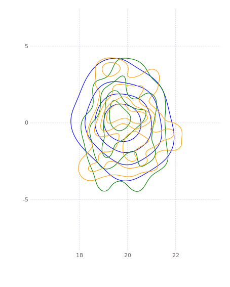
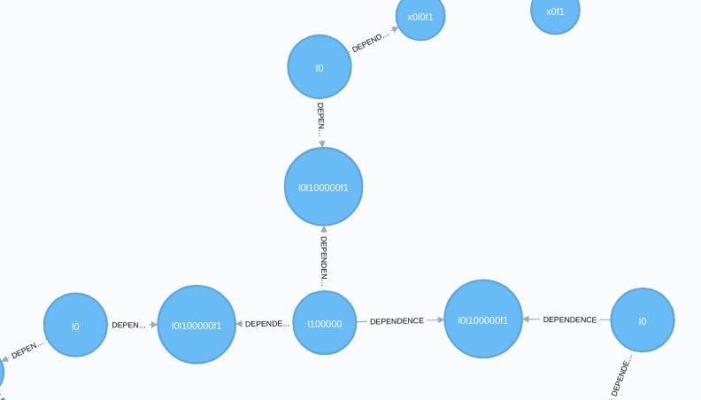
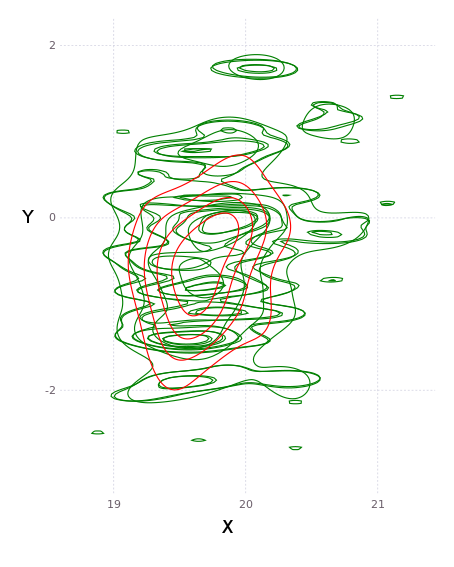
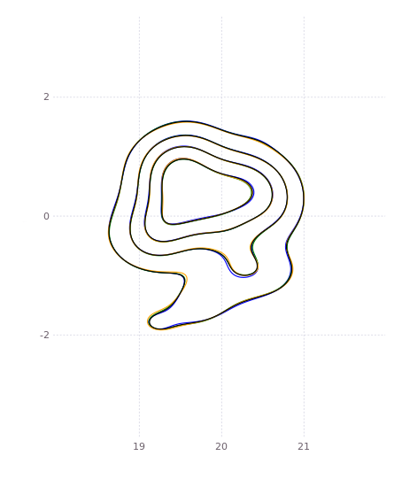

# Multisession Operation

Having all the data consolidated in a factor graph allows us to do something we find really exciting: reason against data for different robots, different robot sessions, even different users. Of course, this is all optional, and must be explicitly configured, but if enabled, current inference solutions can make use of historical data to continually improve their solutions.

Consider a single robot working in a common environment that has driven around the same area a number of times and has identified a landmark that is (probably) the same. We can automatically close the loop and use the information from the prior data to improve our current solution. This is called a multisession solve.

To perform a multisession solve, you need to specify that a session is part of a common environment, e.g 'lab'. A user then requests a multisession solve (manually for the moment), and this creates relationships between common landmarks. The collective information is used to produce a consensus on the shared landmarks. A chain of session solves is then created, and the information is propagated into the individual sessions, improving their results.

# Steps in Multisession Solve
The following steps are performed by the user:
* Indicate which sessions are part of a common environment - this is done via GraffSDK when the session is created
* Request a multisession solve

Upon request, the solver performs the following actions:
* Updates the common existing multisession landmarks with any new information (propagation from session to common information)
* Builds common landmarks for any new sessions or updated data
* Solves the common, multisession graph
* Propagates the common consensus result to the individual sessions
* Freezes all the session landmarks so that the session solving does not update the consensus result
* Requests session solves for all the updated sessions

> **Note** the current approach is well positioned to transition to the "Federated Bayes (Junction) Tree" multisession solving method, and will be updated accordingly in due coarse.  The Federated method will allow faster multi-session solving times by avoiding the current iterated approach.

# Example
Consider three sessions which exist in the same, shared environment.
In this environment, during each session the robot identified the same `l0` landmark, as shown in the below figure.

If we examine this in terms of the estimates of the actual landmarks, we have three independent densities (blue, green, and orange) giving measures of `l0` located at (20, 0):

Now we trigger a multisession solve. For each landmark that is seen in multiple session, we produce a common landmark (we call a prime landmark) and link it to the session landmarks via factors - all denoted in black outline.

A multisession solve is performed, which for each common (prime) landmark, we produce a common estimate. In terms of densities, this is a single answer for the disparate information, as shown in red in the below figure (for a slightly different dataset):

This information is then propagated back to the individual session landmarks, giving one common density for each landmark. As above, our green, blue, and orange individual densities are now all updated to match the consensus shown in black:

The session landmarks are then frozen, and individual session solves are triggered to propagate the information back into the sessions.  Until the federated upgrade is completed, the above process is iterated a few times to allow information to cross propagate through all sessions.  There federated tree solution requires only a single iteration up and down the federated Bayes (Junction) tree. 

# Next Steps

This provides an initial implementation for stitching data from multiple sessions, robots, and users. In the short term, we may trigger this automatically for any shared environments.  Multisession solving along with other automated techniques for additional measurement discovery in data allows the system to 'dream' -- i.e. reducing succint info from the large volumes of heterogenous sensor data.

In the medium future we will extend this functionality to operate in the Bayes tree, which we call 'federated solving', so that we perform the operation using cached results of subtrees. 
