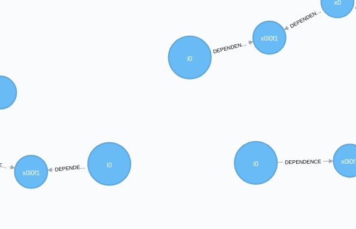

# Multisession Operation

Having all the data consolidated in a factor graph allows us to do something we find really exciting: reason against data for different robots, different robot sessions, even different users. Of course, this is all optional, and must be explicitly configured, but if enabled, current inference solutions can make use of historical (or other robot) data to improve continually improve their solutions.

Consider a single robot working in a common environment that has driven around the same area a number of times and has identified a landmark that is probably the same. We can automatically close the loop and use the information from the prior data to improve our current solution.

To do this, we specify the robot's sessions that are operating in a shared environment, e.g 'lab'. If we then request a multisession solve, relationships between common landmarks are created, and the collective information is used to produce a consensus on the shared landmarks.

TODO: Specifying an environment...

For example, if we identify a simple landmark `l1` in three sessions tagged with the 'lab' environment:

