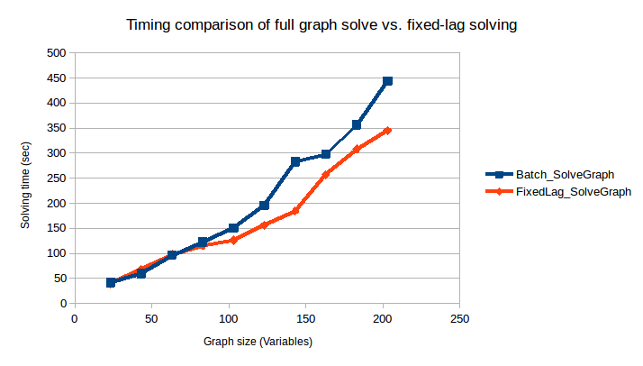

# Hexagonal 2D with Fixed-Lag Solving

> **NOTE:** This is an experimental feature that is currently being developed. This example provides an overview of how to enable it and the benefits of using fixed-lag solving. The objective is to provide a near-constant solve time for ever-growing graphs by only recalculating the most recent portion. Think of this as a placeholder, as we develop the solution this tutorial will be updated to demonstrate how that is achieved.

## Example Code

The complete code for this example can be found in the fixed-lag branch of RoME: [Hexagonal Fixed-Lag Example](https://github.com/JuliaRobotics/RoME.jl/blob/feature/fixedlag_example/examples/Hexagonal2D_SLAM_FixedLag.jl).

## Introduction

Fixed-lag solving is enabled when creating the factor-graph. Users provide a window - the quasi fixed-lag constant (QFL) - which defines how many of the most-recent variables should be calculated. Any other variables are 'frozen'. The objective of this example is to explore providing a near-constant solve time for ever-growing graphs by only recalculating the most recent portion.

## Example Overview

In the example, the basic Hexagonal 2D is grown to solve 200 variables. The original example is remains the same, i.e. a vehicle is driving around in a hexagon and seeing the same bearing+range landmark as it crosses the starting point. At every 20th variable, a solve is invoked. Rather than use `batchSolve()`, the solve is performed in parts (construction of Bayes tree, solving the graph) to get performance statistics as the graph grows.

```julia
numVariables = 200
solveEveryNVariables = 20
lagLength = 30

# Standard Hexagonal example for totalIterations - solve every iterationsPerSolve iterations.
function runHexagonalExample(fg::FactorGraph, totalIterations::Int, iterationsPerSolve::Int)::DataFrame
    # Add the first pose :x0
    addNode!(fg, :x0, Pose2)

    # Add at a fixed location PriorPose2 to pin :x0 to a starting location
    addFactor!(fg, [:x0], PriorPose2(MvNormal(zeros(3), 0.01*Matrix{Float64}(LinearAlgebra.I, 3,3))))

    # Add a landmark l1
    addNode!(fg, :l1, Point2, labels=["LANDMARK"])

    # Drive around in a hexagon a number of times
    solveTimes = DataFrame(GraphSize = [], TimeBuildBayesTree = [], TimeSolveGraph = [])
    for i in 0:totalIterations
        psym = Symbol("x$i")
        nsym = Symbol("x$(i+1)")
        @info "Adding pose $nsym..."
        addNode!(fg, nsym, Pose2)
        pp = Pose2Pose2(MvNormal([10.0;0;pi/3], Matrix(Diagonal( [0.1;0.1;0.1].^2 ) )))
        @info "Adding odometry factor between $psym -> $nsym..."
        addFactor!(fg, [psym;nsym], pp )

        if i % 6 == 0
            @info "Creating factor between $psym and l1..."
            p2br = Pose2Point2BearingRange(Normal(0,0.1),Normal(20.0,1.0))
            addFactor!(fg, [psym; :l1], p2br)
        end
        if i % iterationsPerSolve == 0 && i != 0
            @info "Performing inference!"
            if fg.isfixedlag
                @info "Quasi fixed-lag is enabled (a feature currently in testing)!"
                fifoFreeze!(fg)
            end
            tBuild = @timed tree = wipeBuildNewTree!(fg)
            tInfer = @timed inferOverTree!(fg, tree, N=100)
            graphSize = length([ls(fg)[1]..., ls(fg)[2]...])
            push!(solveTimes, (graphSize, tBuild[2], tInfer[2]))
        end
    end
    return solveTimes
end
```

Two cases are set up:
* One solving the full graph every time a solve is performed:

```julia
# start with an empty factor graph object
fg = initfg()
# DO NOT enable fixed-lag operation
solverTimesForBatch = runHexagonalExample(fg, numVariables, solveEveryNVariables)
```

* The other enabling fixed-lag with a window of 20 variables:

```julia
fgFixedLag = initfg()
fgFixedLag.isfixedlag = true
fgFixedLag.qfl = lagLength

solverTimesFixedLag = runHexagonalExample(fgFixedLag, numVariables, solveEveryNVariables)
```

The resultant path of the robot can be seen by using RoMEPlotting and is drawn if the visualization lines are uncommented:

```julia
#### Visualization

# Plot the many iterations to see that it succeeded.
# Batch
# drawPosesLandms(fg)

# Fixed lag
# drawPosesLandms(fgFixedLag)
```

Lastly, the timing results of both scenarios are merged into a single DataFrame table, exported to CSV, and a summary graph is shown using GadFly.

```julia
using Gadfly
using Colors
using CSV

# Make a clean dataset
rename!(solverTimesForBatch, :TimeBuildBayesTree => :Batch_BayedBuild, :TimeSolveGraph => :Batch_SolveGraph);
rename!(solverTimesFixedLag, :TimeBuildBayesTree => :FixedLag_BayedBuild, :TimeSolveGraph => :FixedLag_SolveGraph);
timingMerged = DataFrames.join(solverTimesForBatch, solverTimesFixedLag, on=:GraphSize)
CSV.write("timing_comparison.csv", timingMerged)

PP = []
push!(PP, Gadfly.layer(x=timingMerged[:GraphSize], y=timingMerged[:FixedLag_SolveGraph], Geom.path, Theme(default_color=colorant"green"))[1]);
push!(PP, Gadfly.layer(x=timingMerged[:GraphSize], y=timingMerged[:Batch_SolveGraph], Geom.path, Theme(default_color=colorant"magenta"))[1]);

plt = Gadfly.plot(PP...,
    Guide.title("Solving Time vs. Iteration for Fixed-Lag Operation"),
    Guide.xlabel("Solving Iteration"),
    Guide.ylabel("Solving Time (seconds)"),
    Guide.manual_color_key("Legend", ["fixed", "batch"], ["green", "magenta"]))
Gadfly.draw(PNG("results_comparison.png", 12cm, 15cm), plt)
```

## Results

Preliminary results for the comparison can be seen below. However, this is just a start and we need to perform more testing. At the moment we are working on providing consistent results and further improving performance/flattening the fixed-lag time. It should be noted that the below graph is not to demonstrate the absolute solve time, but rather the relative behavior of full-graph solve vs. fixed-lag.



> **NOTE** Work is underway to reduce overhead computations that result in poorer fixed-lag solving times.  We expect the fixed-lag performance to improve in the coming months (Written Nov 2018).  Please file issues if a deeper discussion is required. 

## Additional Example

> Work In Progress, but In the mean time see the following examples:
https://github.com/JuliaRobotics/Caesar.jl/blob/master/examples/wheeled/racecar/apriltag_and_zed_slam.jl
